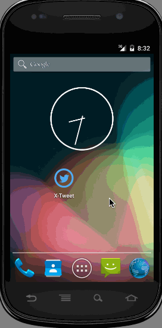

# x-twit-plus

## Demo Walkthrough

## Time Spent: 6 hours

## Stories implemented

- [x] Includes all required user stories from Week 3 Twitter Client
- [x] User can switch between Timeline and Mention views using tabs.
  - [x] User can view their home timeline tweets.
  - [x] User can view the recent mentions of their username.
- [x] User can navigate to view their own profile
  - [x] User can see picture, tagline, # of followers, # of following, and tweets on their profile.
- [x] User can click on the profile image in any tweet to see another user's profile.
  - [x] User can see picture, tagline, # of followers, # of following, and tweets of clicked user.
  - [x] Profile view should include that user's timeline
  - [x] Optional: User can view following / followers list through the profile
  - [x] User can infinitely paginate any of these timelines (home, mentions, user) by scrolling to the bottom
### The following advanced user stories are optional:

- [x] Advanced: Robust error handling, check if internet is available, handle error cases, network failures
- [ ] Advanced: When a network request is sent, user sees an indeterminate progress indicator
- [ ] Advanced: User can "reply" to any tweet on their home timeline
- [x] The user that wrote the original tweet is automatically "@" replied in compose
- [x] Advanced: User can click on a tweet to be taken to a "detail view" of that tweet
- [ ] Advanced: User can take favorite (and unfavorite) or reweet actions on a tweet
- [x] Advanced: Improve the user interface and theme the app to feel twitter branded
- [ ] Advanced: User can search for tweets matching a particular query and see results
- [ ] Bonus: User can view their direct messages (or send new ones)

## Optional stories:

- [x] **Advanced**: While composing a tweet, user can see a character counter with characters remaining for tweet out of 140
- [x] **Advanced**: Links in tweets are clickable and will launch the web browser (see [autolink](http://guides.codepath.com/android/Working-with-the-TextView#autolinking-urls))
- [x] **Advanced**: User can refresh tweets timeline by [pulling down](http://guides.codepath.com/android/Implementing-Pull-to-Refresh-Guide) to refresh (i.e pull-to-refresh)
- [x] **Advanced**: User can open the twitter app offline and see last loaded tweets

  - [x] **Advanced**: Tweets are [persisted into sqlite](http://guides.codepath.com/android/ActiveAndroid-Guide) and can be displayed from the local DB

- [x] **Advanced**: User can tap a tweet to display a "detailed" view of that tweet
- [x] **Advanced**: Improve the user interface and theme the app to feel "twitter branded"
- [ ] **Bonus**: User can see embedded image media within the tweet detail view
- [x] **Bonus**: Compose activity is replaced with a [modal overlay](http://guides.codepath.com/android/Using-DialogFragment)
